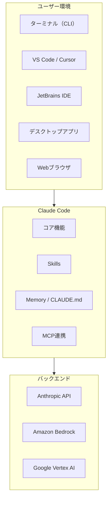
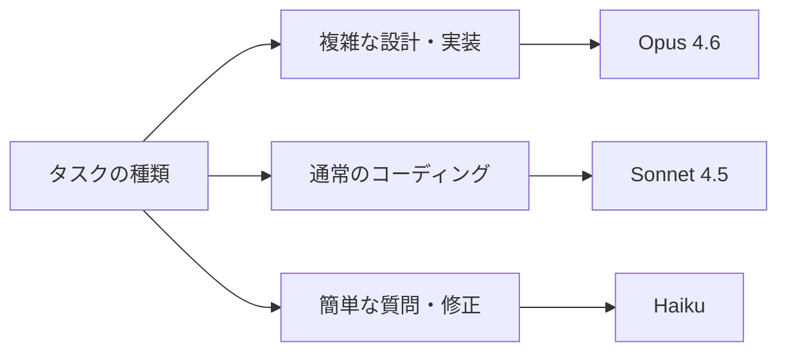
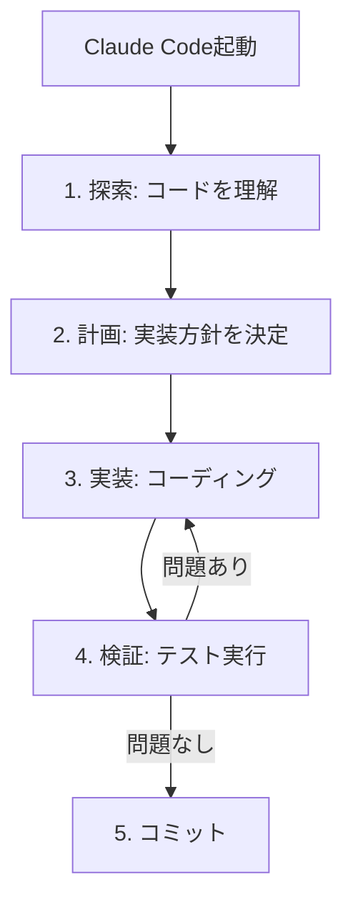
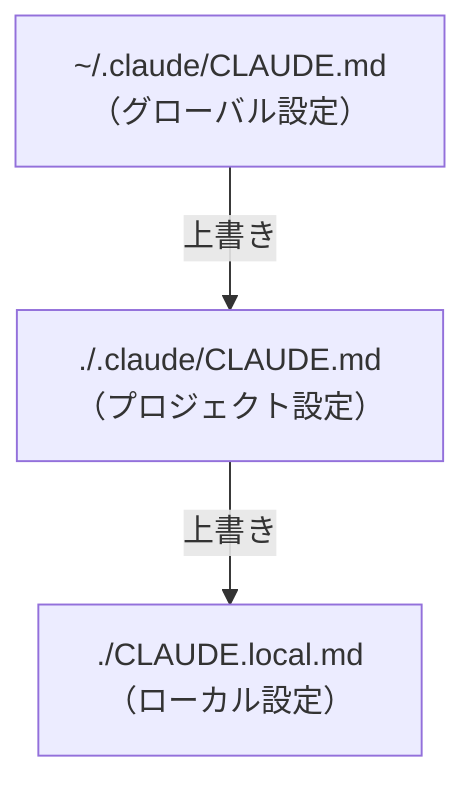
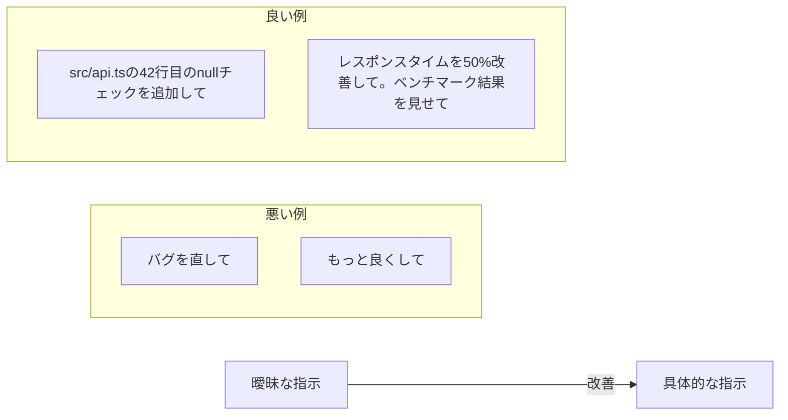
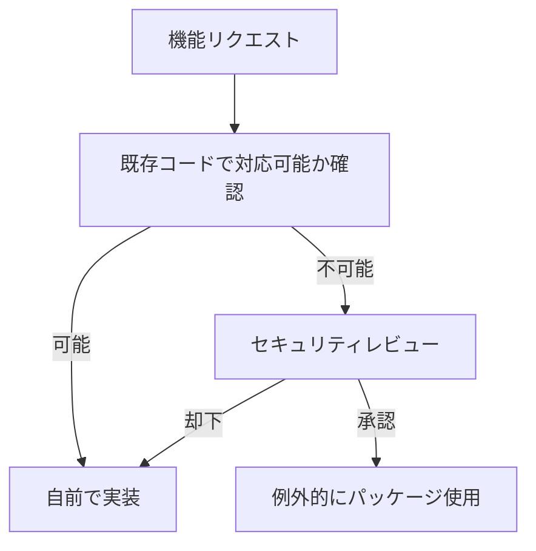

# Claude Code 初心者向けガイド

本ガイドでは、Claude Codeの導入から活用まで、初心者向けに必要な知識をまとめています。

---

## 目次

1. [Claude Codeとは](#1-claude-codeとは)
2. [インストール方法](#2-インストール方法)
3. [モデルについて](#3-モデルについて)
4. [基本的な使い方](#4-基本的な使い方)
5. [スラッシュコマンド一覧](#5-スラッシュコマンド一覧)
6. [Skills機能](#6-skills機能)
7. [CLAUDE.mdとメモリ機能](#7-claudemdとメモリ機能)
8. [ベストプラクティス](#8-ベストプラクティス)
9. [プロジェクト固有のルール](#9-プロジェクト固有のルール)

---

## 1. Claude Codeとは

Claude Codeは、Anthropic社が提供する**エージェント型コーディングツール**です。

### 主な特徴

- コードベースの読み込み・編集・実行を自律的に行う
- ターミナル、VS Code、JetBrains、デスクトップアプリ、Webブラウザで利用可能
- MCP（Model Context Protocol）による外部ツール連携

### 全体構成図



---

## 2. インストール方法

### 2.1 基本インストール

#### macOS / Linux / WSL（推奨）

```bash
curl -fsSL https://claude.ai/install.sh | bash
```

#### Windows PowerShell

```powershell
irm https://claude.ai/install.ps1 | iex
```

#### Windows CMD

```batch
curl -fsSL https://claude.ai/install.cmd -o install.cmd && install.cmd && del install.cmd
```

> **注意**: WindowsではGit for Windowsが事前に必要です。

#### Homebrew（Mac）

```bash
brew install --cask claude-code
```

#### WinGet（Windows）

```powershell
winget install Anthropic.ClaudeCode
```

### 2.2 Amazon Bedrock経由での利用

企業環境でAWS経由でClaude Codeを利用する場合：

```bash
# Bedrockを有効化
export CLAUDE_CODE_USE_BEDROCK=1
export AWS_REGION=us-east-1
```

#### コーポレートプロキシ経由の場合

```bash
export HTTPS_PROXY='https://proxy.example.com:8080'
```

#### LLMゲートウェイ経由の場合

```bash
export ANTHROPIC_BEDROCK_BASE_URL='https://your-llm-gateway.com/bedrock'
```

### 2.3 Google Vertex AI経由での利用

```bash
# Vertex AIを有効化
export CLAUDE_CODE_USE_VERTEX=1
export CLOUD_ML_REGION=us-east5
export ANTHROPIC_VERTEX_PROJECT_ID=your-project-id
```

### 2.4 初回セットアップ

```bash
# Claude Codeを起動
claude

# ログインプロンプトが表示されるのでログイン
# または以下のコマンドでログイン
/login
```

---

## 3. モデルについて

### 3.1 利用可能なモデルと特徴

| モデル | 用途 | 特徴 |
|--------|------|------|
| **Opus 4.6** | 設計・複雑なコーディング | 最高性能。複雑な推論、長いコンテキスト処理に最適 |
| **Sonnet 4.5** | 日常的なコーディング | バランス型。ファイル読み込み、一般的な開発作業に適切 |
| **Haiku** | 簡単なタスク | 高速・低コスト。単純なクエリ、軽微な修正に最適 |

### 3.2 モデル選択の目安



### 3.3 モデルの切り替え

```bash
# インタラクティブモードで切り替え
/model

# コマンドラインオプションで指定
claude --model sonnet
claude --model opus
```

### 3.4 高速モード（Fast Mode）

Opus 4.6を2.5倍高速化するモードです。

```bash
# 高速モードの切り替え
/fast
```

**適した用途**:
- コードの迅速な反復開発
- ライブデバッグセッション
- 時間制約のある作業

**通常モードが適した用途**:
- 長時間の自動化タスク
- バッチ処理やCI/CDパイプライン
- コスト重視のワークロード

> **注意**: 高速モードは追加料金が発生します。サードパーティクラウドプロバイダー（Bedrock/Vertex）では利用不可。

### 3.5 料金について

Claude Codeの利用には有料サブスクリプションが必要です：

- **Claude Pro / Max / Teams / Enterprise** - Anthropicアカウント
- **Console（API）** - 従量課金
- **Amazon Bedrock / Google Vertex AI** - 各クラウドの料金体系

詳細な料金は [Claude Pricing](https://www.anthropic.com/pricing) を参照してください。

---

## 4. 基本的な使い方

### 4.1 起動方法

```bash
# プロジェクトディレクトリで起動
cd /path/to/your/project
claude

# 初期プロンプト付きで起動
claude "このプロジェクトの構造を教えて"

# SDK経由でクエリ実行（バッチ処理向け）
claude -p "このファイルをリファクタリングして"

# パイプ入力を処理
cat error.log | claude -p "このエラーの原因を分析して"
```

### 4.2 セッション管理

```bash
# 最新のセッションを継続
claude -c

# 特定のセッションを再開
claude -r "session-name" "続きを教えて"
```

### 4.3 基本的なワークフロー



---

## 5. スラッシュコマンド一覧

### 5.1 基本コマンド

| コマンド | 説明 |
|----------|------|
| `/help` | 使用方法のヘルプを表示 |
| `/clear` | 会話履歴をクリア |
| `/exit` | REPLを終了 |

### 5.2 セッション管理

| コマンド | 説明 |
|----------|------|
| `/resume [session]` | セッションを再開、または選択画面を開く |
| `/rename <name>` | 現在のセッションの名前を変更 |
| `/rewind` | 会話やコードを前の状態に戻す |

### 5.3 設定・情報表示

| コマンド | 説明 |
|----------|------|
| `/config` | 設定インターフェースを開く |
| `/status` | バージョン、モデル、アカウント情報を表示 |
| `/model` | AIモデルを選択・変更 |
| `/theme` | カラーテーマを変更 |
| `/permissions` | 権限の表示・更新 |
| `/fast` | 高速モードのオン・オフ |

### 5.4 プロジェクト・ファイル管理

| コマンド | 説明 |
|----------|------|
| `/init` | CLAUDE.mdガイドでプロジェクトを初期化 |
| `/memory` | CLAUDE.mdメモリファイルを編集 |
| `/export [filename]` | 会話をファイルまたはクリップボードにエクスポート |

### 5.5 分析・統計

| コマンド | 説明 |
|----------|------|
| `/context` | 現在のコンテキスト使用量を表示 |
| `/cost` | トークン使用統計を表示 |
| `/stats` | 日次使用量、セッション履歴を表示 |
| `/usage` | サブスクリプション使用状況を表示 |

---

## 6. Skills機能

### 6.1 Skillsとは

`SKILL.md`ファイルに指示を記述することで、Claude Codeの機能を拡張できます。

### 6.2 ディレクトリ構造

```
~/.claude/skills/skill-name/
├── SKILL.md           # メインの指示（必須）
├── template.md        # テンプレートファイル
├── examples/          # 使用例
└── scripts/           # 実行可能スクリプト
```

### 6.3 配置場所と適用範囲

| 場所 | パス | 適用範囲 |
|------|------|----------|
| 個人用 | `~/.claude/skills/<name>/SKILL.md` | 全プロジェクト |
| プロジェクト用 | `.claude/skills/<name>/SKILL.md` | 該当プロジェクトのみ |
| エンタープライズ | 管理設定による | 組織全体 |

### 6.4 SKILL.mdの例

```markdown
---
name: create-test
description: テストファイルを自動生成
---

# テスト作成スキル

以下のルールに従ってテストを作成してください：

1. テストファイルは `__tests__` ディレクトリに配置
2. ファイル名は `*.test.ts` 形式
3. describe/it形式でテストを記述
```

---

## 7. CLAUDE.mdとメモリ機能

### 7.1 メモリの種類

| 種類 | 説明 |
|------|------|
| **Auto memory** | Claudeが自動的に学習・保存する内容 |
| **CLAUDE.md** | ユーザーが作成・管理する指示ファイル |

### 7.2 CLAUDE.mdの配置場所

| タイプ | 場所 | 用途 |
|--------|------|------|
| 組織ポリシー | `/Library/Application Support/ClaudeCode/CLAUDE.md` (macOS) | 組織全体の標準 |
| プロジェクトメモリ | `./CLAUDE.md` または `./.claude/CLAUDE.md` | チーム共有の指示 |
| プロジェクトルール | `./.claude/rules/*.md` | モジュール化された指示 |
| ユーザーメモリ | `~/.claude/CLAUDE.md` | 個人設定（全プロジェクト） |
| ローカルメモリ | `./CLAUDE.local.md` | 個人のプロジェクト固有設定 |

### 7.3 優先順位

より具体的な（プロジェクト固有の）指示が、広範囲な指示より優先されます。



### 7.4 CLAUDE.mdの例

```markdown
# プロジェクト設定

## コーディング規約
- TypeScriptを使用
- ESLintルールに従う
- コメントは日本語で記述

## 禁止事項
- console.logを本番コードに残さない
- any型の使用を避ける

## テスト
- 新機能には必ずテストを追加
- カバレッジ80%以上を維持
```

---

## 8. ベストプラクティス

### 8.1 効果的な使い方のポイント

#### 検証方法を提供する

```
# 悪い例
「メールアドレスを検証する関数を実装して」

# 良い例
「validateEmail関数を書いて。
テストケース：user@example.comはtrue、invalidはfalse。
実装後にテストを実行して」
```

#### 探索→計画→実装の順序

1. **探索**: Plan Modeでファイルを読み、理解
2. **計画**: 詳細な実装計画を作成
3. **実装**: Normal Modeでコーディング
4. **検証**: テスト実行
5. **コミット**: 説明的なメッセージでコミット

#### 具体的なコンテキストを提供

- `@`でファイルを参照（例: `@src/utils.ts`）
- スクリーンショットや画像を直接貼り付け
- 既存のパターンを指摘
- 制約や要件を明確に指定

### 8.2 プロンプトの書き方



---

## 9. プロジェクト固有のルール

### 9.1 セキュリティに関する注意事項

#### npmパッケージの取り扱い

> **重要**: npmパッケージは使用しない（ワーム対策）

悪意のあるnpmパッケージによるサプライチェーン攻撃を防ぐため、以下を遵守してください：

- 新規npmパッケージのインストールは禁止
- 必要な機能は自前で実装する
- どうしても必要な場合は、セキュリティレビュー後に許可を得る

### 9.2 推奨ワークフロー



---

## 付録

### CLIオプション一覧

| オプション | 説明 |
|------------|------|
| `--model` | セッションのモデルを設定 |
| `--agent` | 特定のエージェントを指定 |
| `--tools` | 使用可能なツールを制限 |
| `--chrome` | Chromeブラウザ統合を有効化 |
| `--system-prompt` | システムプロンプトを置換 |
| `--append-system-prompt` | システムプロンプトに追加 |

### 参考リンク

- [Claude Code 公式ドキュメント](https://code.claude.com/docs)
- [Anthropic 料金ページ](https://www.anthropic.com/pricing)
- [Model Context Protocol (MCP)](https://modelcontextprotocol.io/)

---

*最終更新: 2026年2月*
